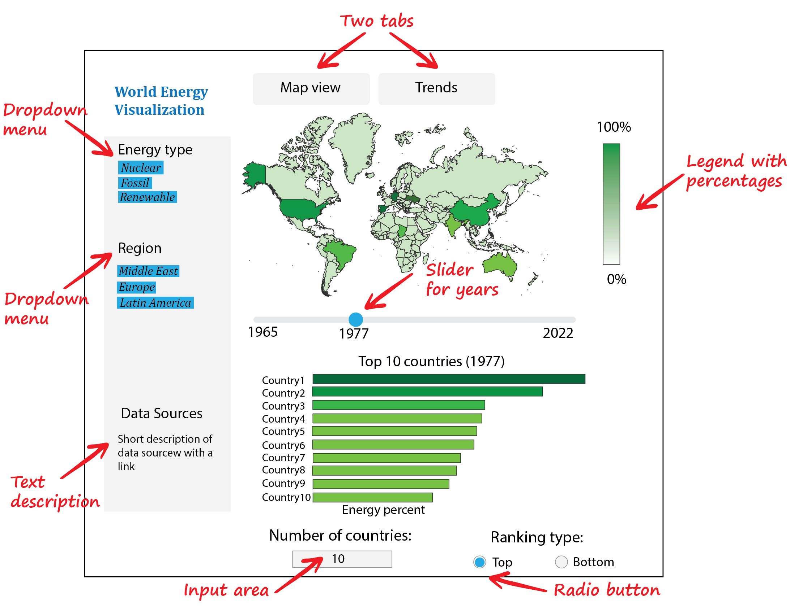

# World Energy Visualization

Authors: Macy Chan, Philson Chan, Mukund Iyer, Pavel Levchenko

This app has a goal to provide easy access to information related to types of energy consumed at every country and multiple regions over the last few decades. This information could be beneficial to policy makers, who are in charge of making measures for preventing climate change, forcing transition to cleaner energy sources. More details for vision regarding this project can be found in the [proposal document](doc/proposal.md).

## Description of the App
World Energy Visualizatoin dashboard will consists of two tabs, where the first tab will provide a high level overview, while the second tab will give a more granular detailed information regarding trends for energy consuption over many years.  As can be seen from the sketch shown in Figure 1, in the main dashboard users will be able gain a high level insight about countries with some dominant type of energy, such as "nuclear", "fossil fuel" or "renewable energy". Also with a simple switch, users of the dashboard could identify countries at the bottom of the list, which are lagging behind in adoption of certain type of energy. Also this tab of the dashboard will be provide visualization of the world map colored by a fraction of energy type consumed in each country. 

At the second tab of the app, users will be able to select one or a few countries for comparison between each other or with certain regions. All those trends of energy consumption over time will be realized as line plots as schematically shown in Figure 2. 

 
## Contributing to this Dashboard
If you have some ideas regarding this project and wish to help, please review our [contributing guidelines](CONTRIBUTING.md).

## License
`world-energy-visualization` dashboard is licensed under the terms of the MIT license.

## Credits
Datasets for visualization of energy trends were downloaded from https://www.kaggle.com/donjoeml/energy-consumption-and-generation-in-the-globe