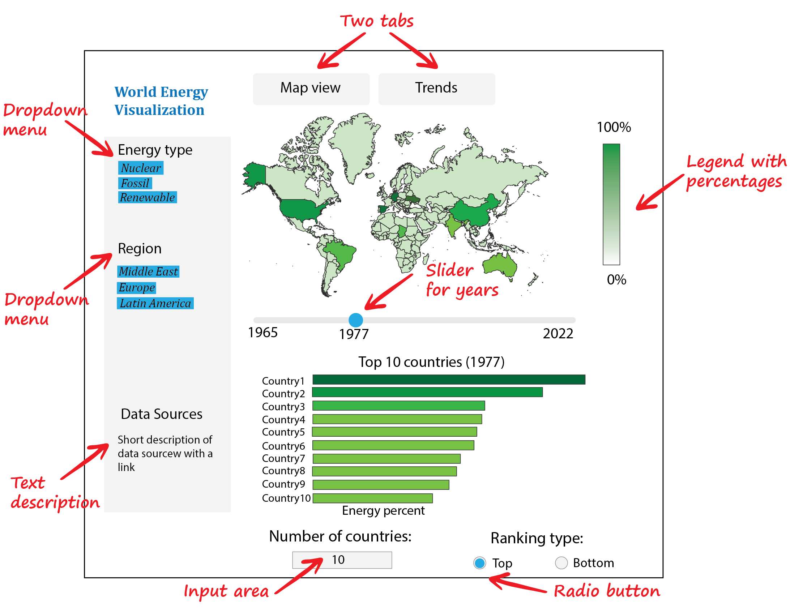
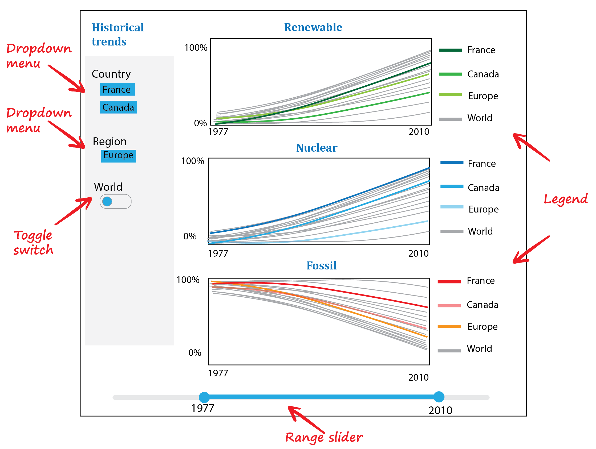

# Description of the Dashboard

World Energy Visualizatoin dashboard will consists of two tabs, where the first tab provides a high level overview, while the second tab gives a more granular detailed information about trends for energy consuption over many years.  As can be seen from the sketch shown in Figure 1, in the main dashboard users will be able gain a high level insight about countries with some dominant type of energy, such as "nuclear", "fossil fuel" or "renewable energy". Also with a simple switch, users of the dashboard will be able to identify countries at the bottom of the list, which are lagging behind in adoption of certain type of energy. Besides this tab of the dashboard will provide visualization of the world map colored by a fraction of energy type consumed in each country.

  
  Figure 1. Overview of the main tab

At the second tab of the app, users will be able to select one or a few countries for comparison between each other or with certain regions. All those trends of energy consumption over time will be realized as line plots as schematically shown in Figure 2.

  
  Figure 2. Prototype for the dashboard with trends

# Roadmap

## World Map of Energy Consumption (tab1)

- Animation of map can be added to show the change of energy consumption throughout the years

## Barchat Chart of Top N Energy Consumption (tab1)

## Line plot of Energy Consumption by energy (tab2)

# Limitation of the Dashboard

- The dashboard is better to be used full screen on Chrome, not mobile compatable,
